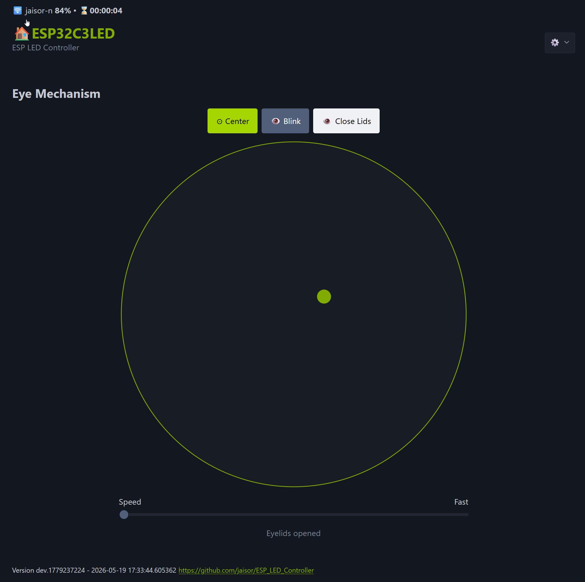
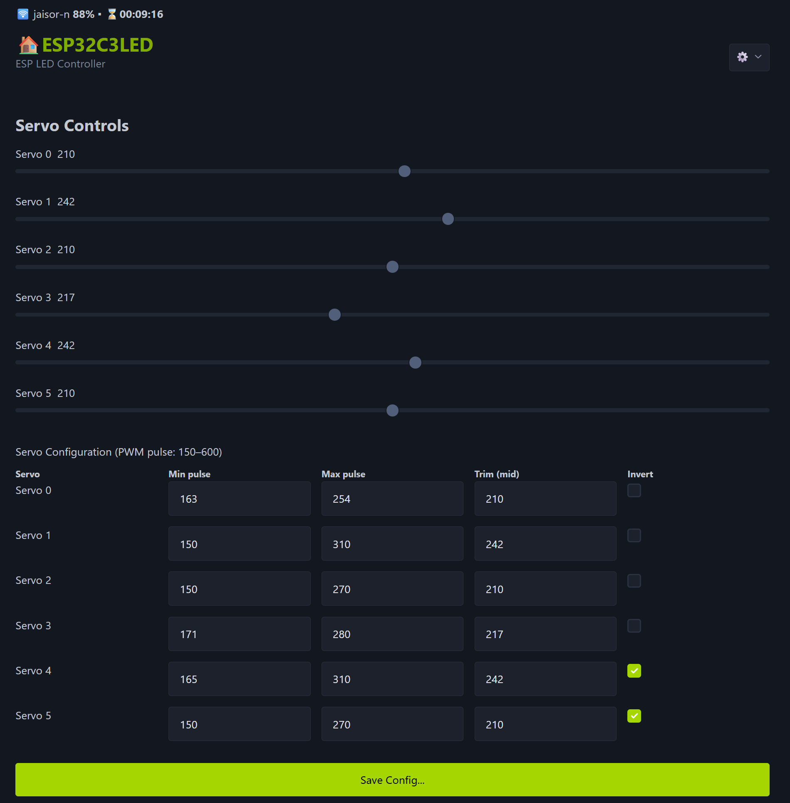
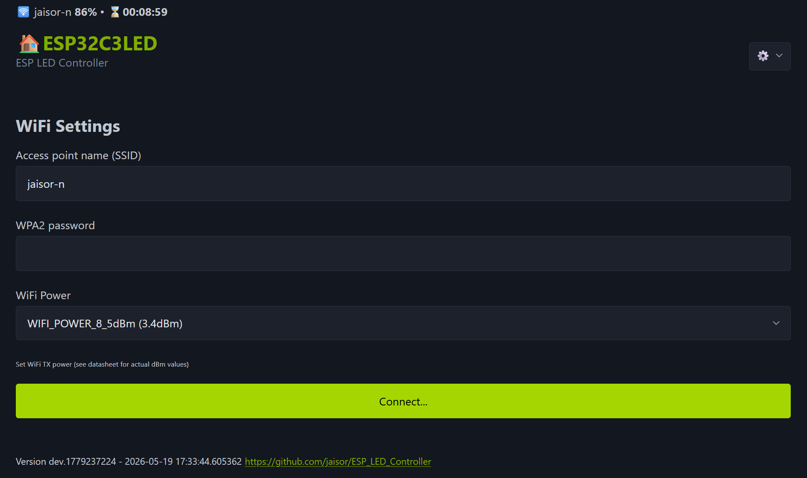

# ESP32 Animatronic Eye Mechanism

WiFi-controlled animatronic eye mechanism powered by an ESP32 and a PCA9685 PWM servo driver. Supports real-time gaze control, smooth interpolated movement, per-servo trim calibration, non-blocking blinks, and full configuration via a built-in web interface with OTA firmware updates.

> Forked from [jaisor/ESP_LED_Controller](https://github.com/jaisor/ESP_LED_Controller) — LED functionality is retained but the primary focus of this project is the eye mechanism.

---

## Features

- **6-axis eye mechanism** — two eyes, each with left/right, up/down, and eyelid servos
- **Real-time gaze control** — click/drag touchpad in the web UI; fractional-precision coordinates sent over WiFi
- **Smooth interpolated movement** — configurable speed (1–8) with per-step interpolation
- **Per-servo trim calibration** — independent midpoint trim per channel, stored in flash
- **Non-blocking blink** — three-phase state machine (close → hold pause → open)
- **Web UI** — servo control sliders, gaze pad, eyelid toggle, blink button, servo config table
- **OTA updates** — upload `firmware.bin` at `/update`
- **LED strip support** — original LED animation modes preserved (optional, `#define LED`)

---

## Hardware

| Component | Notes |
|---|---|
| ESP32 (recommended) | Tested on ESP32-C3 and ESP32-S3 |
| PCA9685 PWM Servo Driver | I²C address 0x40 |
| 6× analog servos | Channels 0–5 on PCA9685 |
| 5V power supply | Sized for servo stall current |

### Servo Channel Mapping

| Channel | Eye | Axis |
|---|---|---|
| 0 | Right | Left / Right |
| 1 | Right | Up / Down |
| 2 | Right | Eyelid |
| 3 | Left | Left / Right |
| 4 | Left | Up / Down |
| 5 | Left | Eyelid |

---

## 3D Model & Printing

> **TODO:** Add link to 3D model files (Printables / Thingiverse / GitHub Releases)

<!-- PLACEHOLDER – replace with actual link -->
**3D Model:** _link coming soon_

### Print Settings

> **TODO:** Document recommended print settings (material, layer height, supports, infill).

### Assembly Instructions

> **TODO:** Document step-by-step assembly — servo mounting, linkage geometry, eye socket fit, wiring harness routing.

---

## Software Setup

### Building & Flashing

```bash
# Build for ESP32-C3 (default)
pio run -e esp32c3

# Upload via USB
pio run -e esp32c3 -t upload

# Serial monitor
pio device monitor -b 115200
```

### OTA Updates

Once the device is on the network, upload `firmware.bin` to:

```
http://<device-ip>/update
```

---

## Configuration

Edit [`src/Configuration.h`](src/Configuration.h) for compile-time defaults:

- `DEVICE_NAME` — AP/hostname
- `WIFI_SSID` / `WIFI_PASSWORD` — default station credentials
- `SERVO_PULSE_MIN` / `SERVO_PULSE_MAX` — global PWM tick range (default 150–600)
- `#define LED` / `#define RING_LIGHT` — enable LED strip features

Runtime servo configuration (min, max, trim, invert per channel) is saved to flash and managed from the **Servo** page in the web UI.

---

## Web Interface

| URL | Description |
|---|---|
| `/` | Main LED control (if enabled) |
| `/servo` | Servo range, trim, and invert config |
| `/eyemech` | Live gaze control pad + blink/eyelid controls |
| `/wifi` | WiFi SSID, password, and TX power settings |
| `/update` | OTA firmware upload |
| `/factoryreset` | Wipe flash config and reboot |

### Eye Mechanism Control (`/eyemech`)

Click or drag inside the circle to point the eyes at that position. The dot tracks the current gaze target. Buttons above the pad centre the eyes, trigger a blink, or toggle the eyelids. The Speed slider controls how fast the eyes interpolate to the new position.



### Servo Settings (`/servo`)

The top section provides real-time PWM sliders for each of the 6 servo channels — useful for finding the correct min/max travel for your physical mechanism. The configuration table below lets you set the Min pulse, Max pulse, Trim (midpoint), and Invert flag per channel; changes are saved to flash on **Save Config**.



### WiFi Settings (`/wifi`)

Enter the SSID and WPA2 password of your local network and choose a TX power level, then press **Connect**. On first boot the device creates its own access point (`192.168.4.1`) so you can reach this page without a pre-existing network.


